<!-- ═══════════════════════════════════════════════════════ -->
<!-- HEADER — Banner animado customizado -->
<!-- ═══════════════════════════════════════════════════════ -->

 

<!-- TYPING SVG -->

 

<!-- ═══════════════════════════════════════════════════════ -->
<!-- ABOUT ME — Terminal animado -->
<!-- ═══════════════════════════════════════════════════════ -->
## &nbsp;`> whoami`

 

<!-- ═══════════════════════════════════════════════════════ -->
<!-- TECH STACK -->
<!-- ═══════════════════════════════════════════════════════ -->
## &nbsp;`> cat stack.md`

 

**`BACKEND`**

 
 

**`FRONTEND`**

 
 

**`TOOLS`**

 

 

<!-- ═══════════════════════════════════════════════════════ -->
<!-- STATUS -->
<!-- ═══════════════════════════════════════════════════════ -->
## &nbsp;`> cat status.log`

> **Trabalhando em** — Sistemas de gestão com Laravel + React
>
> **Estudando** — Arquitetura limpa & Design Patterns
>
> **Experimentando** — Docker, CI/CD, testes automatizados
>
> **Aberto a** — Colaborações em projetos open source

 

<!-- ═══════════════════════════════════════════════════════ -->
<!-- PROJETOS -->
<!-- ═══════════════════════════════════════════════════════ -->
## &nbsp;`> ls ~/projetos --destaque`

&nbsp;

&nbsp;

 

<!-- ═══════════════════════════════════════════════════════ -->
<!-- GITHUB STATS -->
<!-- ═══════════════════════════════════════════════════════ -->
## &nbsp;`> neofetch --github`

&nbsp;

 

 

<!-- ACTIVITY GRAPH -->

 

<!-- ═══════════════════════════════════════════════════════ -->
<!-- METRICS — Lowlighter (gerado automaticamente) -->
<!-- ═══════════════════════════════════════════════════════ -->
## &nbsp;`> cat metrics.json`

&nbsp;

&nbsp;

 

<!-- TROPHIES -->

 

<!-- ═══════════════════════════════════════════════════════ -->
<!-- SNAKE -->
<!-- ═══════════════════════════════════════════════════════ -->

<picture>
  <source media="(prefers-color-scheme: dark)" srcset="https://raw.githubusercontent.com/Matheuz0001/Matheuz0001/output/github-snake-dark.svg" />
  <source media="(prefers-color-scheme: light)" srcset="https://raw.githubusercontent.com/Matheuz0001/Matheuz0001/output/github-snake.svg" />
  
</picture>

 

<!-- ═══════════════════════════════════════════════════════ -->
<!-- CONTATO -->
<!-- ═══════════════════════════════════════════════════════ -->
## &nbsp;`> cat contato.md`

&nbsp;

 

<!-- ═══════════════════════════════════════════════════════ -->
<!-- FOOTER -->
<!-- ═══════════════════════════════════════════════════════ -->

 

